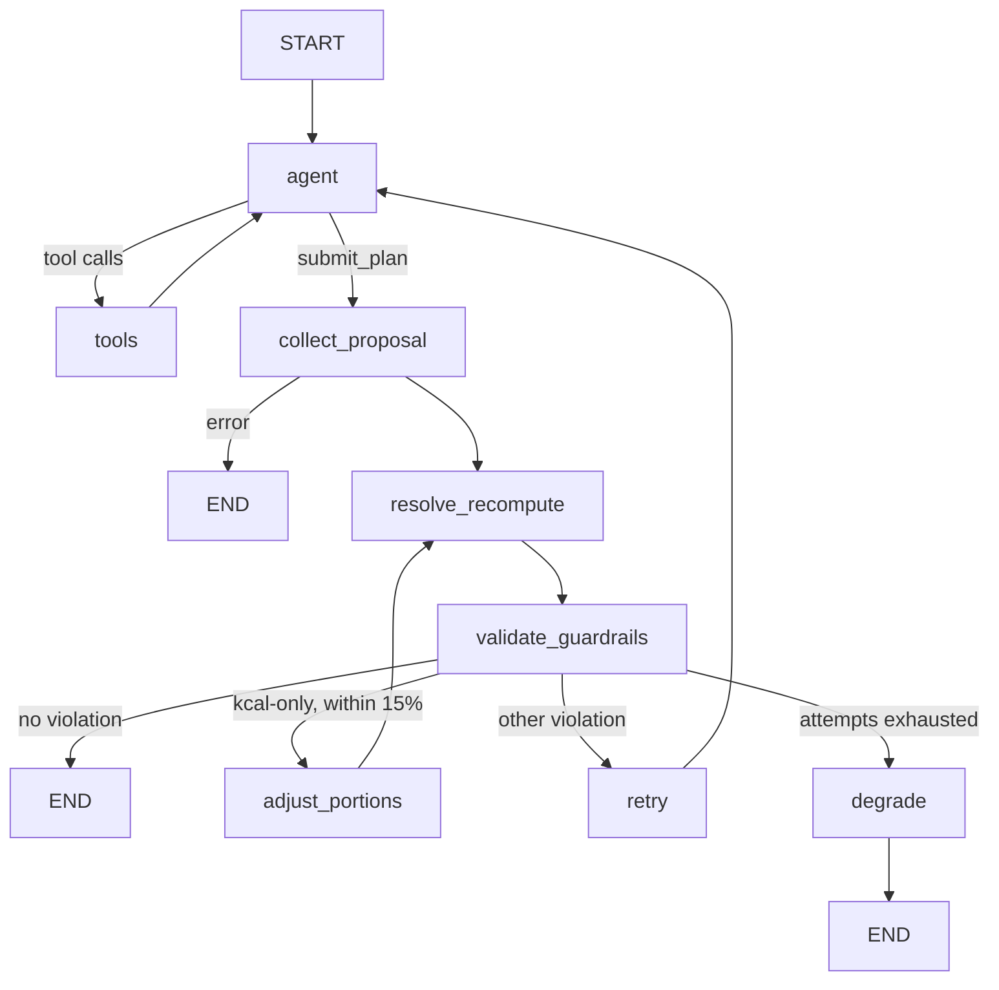

# GenPlanAliment

AI agent for daily meal planning. An LLM composes the plan; every safety-critical
calculation (calorie target, floor, exclusions, totals) is deterministic Python.

Data sources: a SQLite weekly activity calendar, a JSON preferences file, and the
USDA FoodData Central API.

## Prerequisites

- Python 3.12+
- A free USDA FoodData Central API key — https://fdc.nal.usda.gov/api-guide
- A Gemini API key (default provider) or a Groq API key

## Installation

```bash
python -m venv venv
venv\Scripts\activate            # Windows;
```

### Environment

```bash
copy .env.template .env        
```

Then fill in `.env`:

| Variable | Required | Notes |
|---|---|---|
| `USDA_API_KEY` | yes | FoodData Central key |
| `LLM_PROVIDER` | yes | `gemini` (default) or `groq` |
| `GEMINI_API_KEY` | yes | validated at import even when `LLM_PROVIDER=groq` |
| `GROQ_API_KEY` | yes | validated at import even when `LLM_PROVIDER=gemini` |

Keys are read at import time: a missing key raises on startup, not mid-request.

### Database

Seed the weekly activity calendar into `data/activity/meal_prep.db`. Run from the
project root:

```bash
python -m data.activity.seed_activity_calendar
```

The `activity_calendar` table is created by `data/activity/store.py` on first
connection; this script only inserts the seven seed rows, and only if the table is
empty (safe to re-run). Both `meal_prep.db` and the USDA response cache
(`data/usda/usda_cache.db`, created automatically on first lookup) are gitignored,
so a fresh clone starts with an empty cache.

## Running it

Web UI (Streamlit):

```bash
streamlit run app.py
```

CLI — generates one day's plan and prints it as JSON, for a hardcoded 45 y / 100 kg /
196 cm weight-loss profile:

```bash
python main.py monday
```

The day argument is optional and defaults to `monday`. Valid values: `monday`
through `sunday`.

Tests:

```bash
pytest -v
```

## Architecture

One LangGraph graph per `generate()` call (`core/agent/graph.py`):



- `agent ⇄ tools` — the LLM searches USDA (`search_food_tool`), reads macros
  (`get_nutrition_tool`), and can check its own arithmetic with `compute_plan_total`
  before submitting.
- `resolve_recompute` — every total is re-derived from USDA. No number produced by
  the LLM ever reaches the user.
- `validate_guardrails` — calorie conformity (±10%), disliked foods, invented
  `fdc_id`s. Never mutates the plan; only routes.
- `adjust_portions` — when calories are the only violation and within 15% of target,
  grams are rescaled deterministically (rounded to 5 g, clamped to 20–400 g per food)
  instead of spending a retry.
- `degrade` — after 2 attempts the plan is shown anyway, with a visible warning.

Layering rule: `core/` never imports `streamlit`.

```
core/agent/       graph, prompts, schemas, guardrails, provider adapters
core/nutrition/   Mifflin-St Jeor, METs, calorie target — pure functions
core/tools/       the two LLM-facing USDA tools
data/             SQLite calendar, JSON preferences, USDA client + cache
ui/               Streamlit components, theme, session state
fixtures/         demo plan / profile / week (offline fallback)
```

## Design decisions

- **LLM**: Gemini (`gemini-3.5-flash-lite`) by default, Groq (`openai/gpt-oss-120b`)
  as the alternative. `LLM_PROVIDER` selects one at import — a single adapter
  interface (`get_llm()` + `classify_exception()`), so adding Azure OpenAI is one new
  file under `core/agent/providers/`. This is a portability switch, not automatic
  failover: switching providers requires a restart.
- **Orchestration**: LangGraph — the graph *is* the architecture diagram.
- **Metabolic calculation**: Mifflin-St Jeor with a sex-neutral constant (biological
  sex isn't collected, per data minimization) + Compendium of Physical Activities
  METs, additive and daily, never a weekly activity factor.
- **UI**: Streamlit, for prototype speed.

## Guardrails

| Ref. | Guardrail | Where |
|---|---|---|
| G1 | Calorie floor (1200 kcal) + capped deficit (500 kcal or 25% of TDEE) | `core/nutrition/targets.py` |
| G2 | Disliked foods excluded in Python, never delegated to the LLM | `core/agent/guardrails.py` |
| G3 | Every total recomputed from USDA, never the LLM's own arithmetic | `core/agent/graph.py::resolve_recompute_node` |
| G4 | Medical disclaimer | System prompt + UI footer |
| G5 | Plausible bounds on age/weight/height | `ui/components/sidebar_profile.py` |
| G6 | Preferences sanitized before entering the prompt | `core/agent/guardrails.py::sanitize_preference_items` |
| G7 | Max 2 attempts, then degraded mode with a visible warning | `core/agent/graph.py` |
| G8 | New preference terms rejected unless USDA recognizes them as food (fails open on API errors) | `core/agent/preference_validation.py` |
| G-exists | Invented/unresolvable `fdc_id`s rejected, not silently dropped from the total | `core/agent/graph.py::validate_guardrails_node` |

## Resilience

- **USDA**: 5 s timeout, 2 retries on timeout/connection/5xx, `Retry-After` honoured
  on 429, four normalized error codes (`not_found`, `rate_limited`, `timeout`,
  `api_error`). Errors are returned *to the LLM* as tool output so it can adapt,
  never raised.
- **USDA quota** (1000 req/h): mitigated by a permanent write-through SQLite cache on
  both search and nutrition lookups. There is no request counter — see Known limits.
- **LLM**: 2 retries with backoff on rate-limit/timeout, then a normalized error
  code; `generate()` never raises.
- **Demo mode**: the "Demo plan" button reloads a pre-generated plan
  (`fixtures/demo_plan.py`) with no LLM call and no network — the quota fallback.

## Known limits (assumed, not oversights)

- Biological sex isn't collected (±83 kcal on the BMR, within the formula's own
  error margin).
- Only 4 macros (kcal, protein, fat, carbs) are exposed to the LLM; guardrails check
  calories only, not the macro split.
- Dislikes are matched by case-insensitive substring, so a short entry can over-match
  a longer food name.
- Dislikes are preferences, not allergies — no allergen handling.
- Sedentary base is fixed at ×1.2 — doesn't distinguish a physical job from a desk job.
- Not every Compendium activity is graded (e.g. yoga); intensity then has no effect,
  with a visible note.
- No USDA request counter, no per-user isolation, no authentication, no tracing —
  out of prototype scope.

## Tests

Deterministic, safety-critical logic is covered: `core/nutrition/`,
`core/agent/guardrails.py`, the graph's routing, and the USDA client/cache. The LLM
is mocked throughout. No Streamlit UI tests.