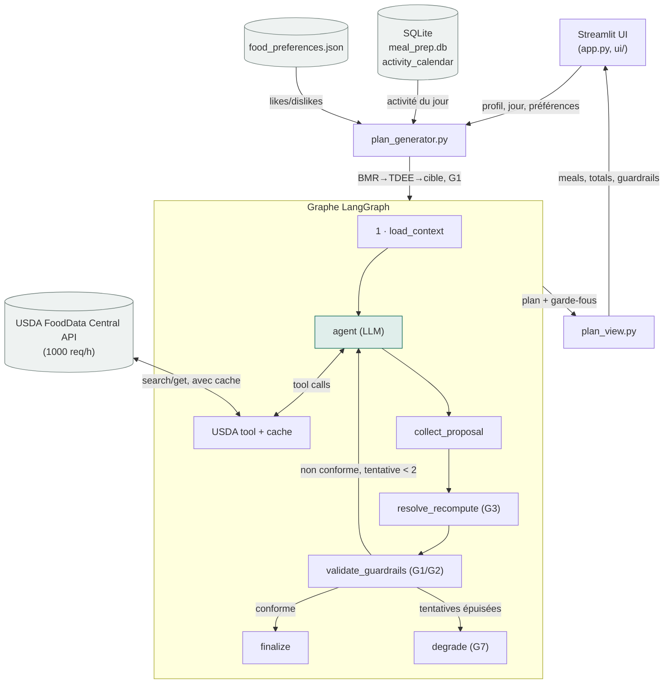

# Schéma d'architecture — Agent Meal Prep

Flux de données du profil utilisateur jusqu'au plan affiché. Chaque boîte correspond
à un module réel du code (voir le nom entre parenthèses) -- ce diagramme et le graphe
`core/agent/graph.py` sont la même structure, pas un dessin fait après coup (D2).

## Évolutions possibles (hors périmètre actuel)

- Human-in-the-loop : nœud de validation humaine entre `validate_guardrails` et `finalize`.
- Multi-agent : un second agent spécialisé (ex. macros) en parallèle du nœud 2.
- RAG : aucun corpus documentaire dans l'énoncé — non construit, placé ici comme extension.
- Multi-utilisateurs, authentification, plan hebdomadaire complet, liste d'épicerie,
  déploiement cloud, base vectorielle, fine-tuning.
