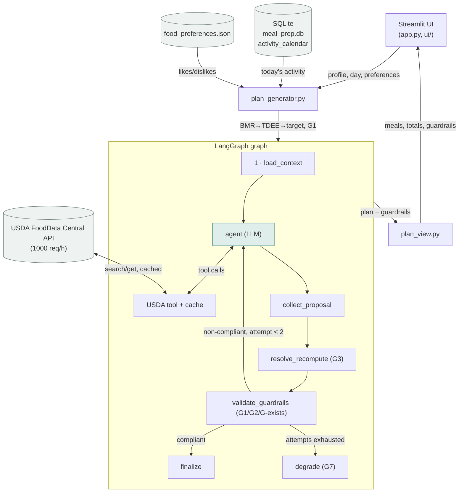

# Architecture diagram — Agent Meal Prep

Data flow from the user profile to the displayed plan. Each box maps to a real
module (named in parentheses) — this diagram and `core/agent/graph.py` are the
same structure, not a drawing made after the fact.

## Possible evolutions (out of current scope)

- Human-in-the-loop: a human validation node between `validate_guardrails` and `finalize`.
- Multi-agent: a second specialized agent (e.g. macros) alongside node 2.
- RAG: no document corpus in the requirements — not built, listed here as an extension.
- Multi-user support, authentication, a full weekly plan, a grocery list, cloud
  deployment, a vector store, fine-tuning.
